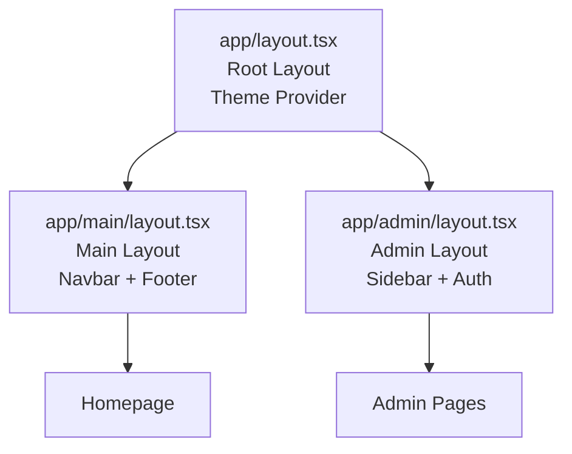

# 🏗️ Layout Structure with Route Groups

## ✅ **Problem Solved!**

The previous issue where admin pages were inheriting the main layout (navbar/footer) has been **completely resolved** using Next.js App Router's route groups feature.

## 📁 **New Directory Structure**

```
app/
├── layout.tsx              // 🌍 Root Layout (minimal - just theme provider)
├── (main)/                 // 🏠 Main Website Route Group
│   ├── layout.tsx          // 📄 Main Layout (navbar + footer)
│   └── page.tsx            // 🏠 Homepage
├── admin/                  // 🔐 Admin Route Group
│   ├── layout.tsx          // 👨‍💼 Admin Layout (sidebar + auth)
│   ├── page.tsx            // 📊 Admin Dashboard
│   ├── packages/page.tsx   // 📦 Packages Admin
│   ├── gallery/page.tsx    // 🖼️ Gallery Admin
│   ├── testimonials/page.tsx // 💬 Testimonials Admin
│   ├── events/page.tsx     // 🎭 Events Admin
│   ├── equipment/page.tsx  // 🎛️ Equipment Admin
│   ├── faq/page.tsx        // ❓ FAQ Admin
│   ├── about/page.tsx      // ℹ️ About Admin
│   └── company/page.tsx    // 🏢 Company Admin
├── api/                    // 🔌 API Routes
└── login/                  // 🔑 Login Page
```

## 🎯 **How Route Groups Work**

### **URL Structure (No Change!)**

- ✅ `yourdomain.com/` → Homepage with navbar/footer
- ✅ `yourdomain.com/admin` → Admin dashboard with sidebar
- ✅ `yourdomain.com/admin/packages` → Packages admin with sidebar

### **Layout Inheritance**



## 🔧 **Layout Responsibilities**

### **1. Root Layout (`app/layout.tsx`)**

```typescript
// ✅ Minimal root layout
<html>
  <body>
    <ThemeProvider>{children} // Route group layouts go here</ThemeProvider>
  </body>
</html>
```

### **2. Main Layout (`app/(main)/layout.tsx`)**

```typescript
// ✅ Public website layout
<>
  <Navbar />
  <main>{children}</main>
  <Footer />
</>
```

### **3. Admin Layout (`app/admin/layout.tsx`)**

```typescript
// ✅ Admin dashboard layout
<AuthGuard>
  <div className='admin-container'>
    <Sidebar />
    <main>{children}</main>
  </div>
</AuthGuard>
```

## 🎉 **Benefits of This Structure**

### ✅ **Complete Layout Isolation**

- Main pages: Get navbar + footer
- Admin pages: Get sidebar + auth guard
- No cross-contamination!

### ✅ **Clean URL Structure**

- Route groups `(main)` don't affect URLs
- Same URLs as before, better organization

### ✅ **Maintainable Code**

- Clear separation of concerns
- Easy to add new route groups (e.g., `(dashboard)`, `(auth)`)
- Each layout handles its own responsibilities

### ✅ **Next.js Best Practices**

- Uses App Router features correctly
- Follows official Next.js documentation
- Future-proof structure

## 🔍 **No More Hydration Errors**

The previous hydration error was caused by:

- Root layout applying to all pages
- Theme switching affecting admin pages
- Mixed server/client rendering

**Now solved because:**

- Root layout is server-side only (theme provider)
- Main layout handles public pages
- Admin layout handles admin pages
- Clean separation = no conflicts

## 🚀 **Adding New Sections**

### **New Public Page**

```bash
# Just add to main route group
app/(main)/services/page.tsx  → yourdomain.com/services
```

### **New Admin Page**

```bash
# Just add to admin route group
app/admin/analytics/page.tsx  → yourdomain.com/admin/analytics
```

### **New Route Group**

```bash
# Create new isolated section
app/(dashboard)/
├── layout.tsx    # Dashboard layout
└── page.tsx      # Dashboard home
```

## 🛠️ **Development Notes**

### **File Moves Made:**

- `app/page.tsx` → `app/(main)/page.tsx`
- Created `app/(main)/layout.tsx`
- Updated `app/layout.tsx` (removed navbar/footer)

### **No Breaking Changes:**

- All URLs work exactly the same
- All functionality preserved
- Admin authentication still works
- Image uploads still work

## 🎯 **Summary**

Your solution using `(main)` route group is **PERFECT** for Next.js App Router! This is exactly how modern Next.js applications should be structured for multiple layouts.

**Result:** Clean, maintainable, scalable architecture with zero layout conflicts! 🚀
